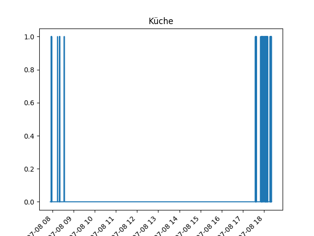
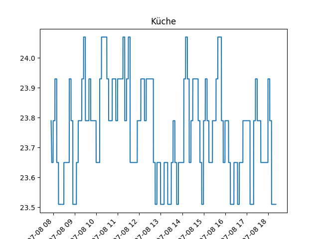
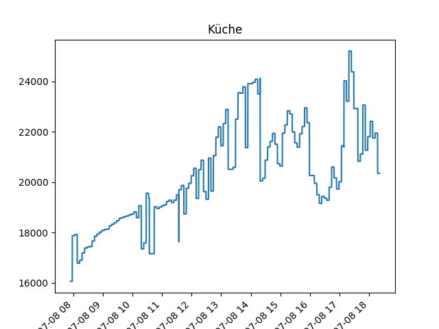

# hue
Python scripts to read hue sensors

## Install packages
```python
pip install -r requirements.txt
```

## Config
open Hue.py and insert the names of your sensor

## Run
```bash
./Hue.py
```

## Plot
```bash
./plot.py
```




